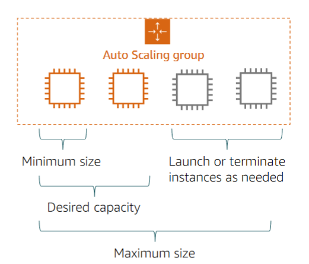
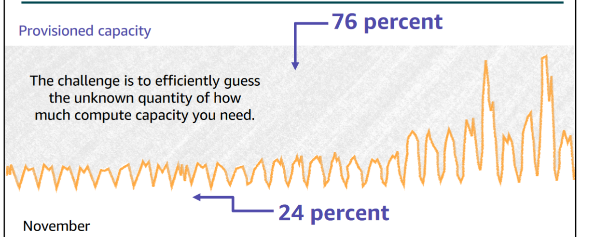

# Autoscaling
Maintain application availability, enabling you to add/remove instances according to defined conditions.
|Before|After|
|-|-|
|||

## Autoscaling groups
- Logical grouping
- Size depends on *desired capacity*
- Specify number of instances
- Adjusts size of group so it has specified number of instances
- Minimum size
- Desired capacity

## Scale out vs. scale in

Launching instance -> scale out
Terminate instance -> scale in

## How Amazon EC2 Auto Scaling works
EC2 Autoscaling works with CloudWatch and Load Balancing, detecting certain metrics and automatically creating new instances.
It does so with a launch template[^1], where you specify the **AMI**, **instance type**, **IAM details**, storage(EBS/EFS), and/or security groups.
EC2 Autoscaling automatically scales out and scales in based on the load of your servers.

## Options
Maintain current instance levels at all times
- Manual scaling
- Scheduled scaling
- **Predictive scaling**
	- learns from past data to predict traffic
- Dynamic scaling
	- Reactive
	- Setup CloudWatch alarm

## AWS Autoscaling
- Separate service from EC2 Auto Scaling

[^1]: Launch configurations are deprecated and slated for removal.