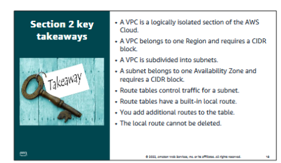

# VPC
[Student Guide](https://awsacademy.instructure.com/courses/45181/modules/items/3885285)
> [!NOTE]  
> A background in networking is assumed. 
> View the Student Guide if you do not know networking.

## What is VPC?
VPC stands for Virtual Private Cloud, which is a **virtual network isolated** from other AWS networks. 

VPCs belong to **a single region** and can span AZs.

VPCs can be divided into subnets, or ranges of IPs in a VPC.

## IP addressing
A CIDR block is assigned by the user at creation time, and **cannot be changed**.  
|Largest|Smallest|
|-|-|
|/16|/28|
|65536 addr|16 addr|

- VPC and subnet can have same CIDR, but in that case you can only have 1 subnet.
- Subnets need their own CIDR block.
- The CIDR of each subnet can be determined by **how many subnets are available**

### Reserved IPs
For every subnet, **5 IPs are reserved** and cannot be used.  
They are:
- Network address
- VPC local router (internal communications)
- Domain Name System (DNS) resolution
- Future use
- Network broadcast address

### IP types
- Public IPv4 address
    - Manually assigned via Elastic IP
    - **Must enable Auto-assign public IP at subnet level, upon EC2 instance creation, you cannot change this property!**
- Elastic IP
    - Public IPv4
    - Associated with AWS acct.
    - Added costs $$ may apply
    - Can allocate and remap anytime

## ENI
An elastic network interface is a virtual network interface that you can:
• Attach to an instance.
• Detach from the instance, and attach to another instance to redirect network traffic

## Route tables
- Route tables configure the routes for network traffic from subnet
- Route tables contain a local route by default
- Subnets MUST be associated with route tables.

## Key takeaways
